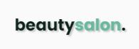

<h1 align="center">
    
</h1>

    <a href="#-tecnologias">Tecnologias</a>&nbsp;&nbsp;|&nbsp;&nbsp;
    <a href="#-projeto">Projeto</a>&nbsp;&nbsp;|&nbsp;&nbsp;
    <a href="#-layout">Layout</a>&nbsp;&nbsp;|&nbsp;&nbsp;
    <a href="#-features">Features extras</a>&nbsp;&nbsp;|&nbsp;&nbsp;
    <a href="#-licença">Licença</a>

    

    

## 🛠 Tecnologias

Esse projeto foi desenvolvido com as seguintes tecnologias:

- HTML
- CSS
- JavaScript

Bibliotecas

- [Google Fonts](https://fonts.google.com/)
- [SwiperJS](https://swiperjs.com/)
- [ScrollReveal](https://scrollrevealjs.org/)
- [Underscore.js](https://underscorejs.org/)

Utilitários

- [IconMoon](https://icomoon.io/)

## 💻 Projeto

O projeto **beautysalon** é um landing page, responsiva, para usar em diversos tipos de micro, pequena e média empresas. Contém as seguintes seções: Header, Navigataion, Home, Sobre, Serviços, Depoimentos, Contato e Footer. Criado durante **Next Level Week 6** dentro da trilha *Origin*.
Acesse o site [clicando aqui](https://brendon3578.github.io/beautysalon/).

## 📷 Layout

O layout da aplicação está disponível no Figma:

## ☕ Features extras

Funcionalidades criadas por mim, não elaborardas durante a trilha *Origin*.

- [x] Botão de trocar a cor principal do site
- [x] Light/Dark Mode Toggle Button
- [x] Sombreamento em títulos e icones 

## 📝 Licença

Esse projeto está sob a licença MIT. Veja o arquivo [LICENSE](.github/LICENSE.md) para mais detalhes.

---

<h3 align="center">
    Feito com ☕ por <a href="https://github.com/Brendon3578">Brendon Gomes</a>
</h3>
